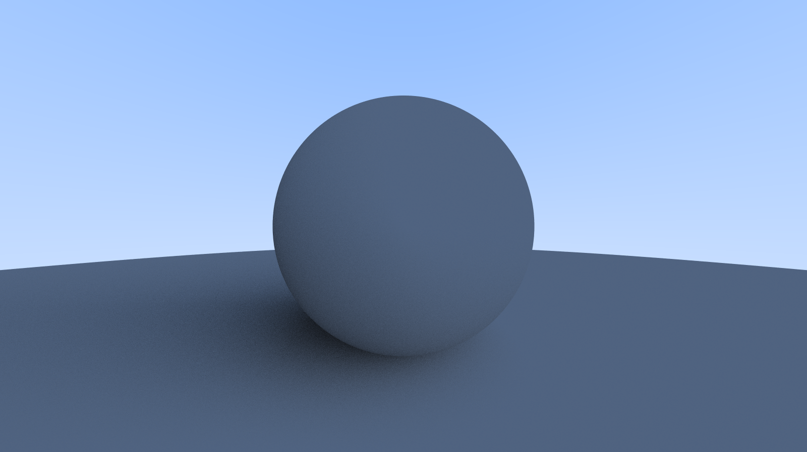
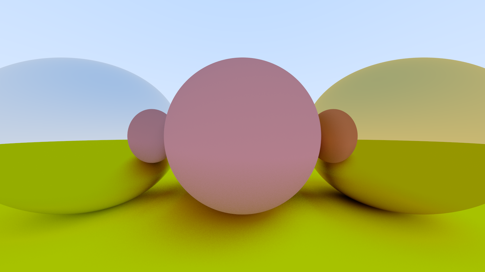
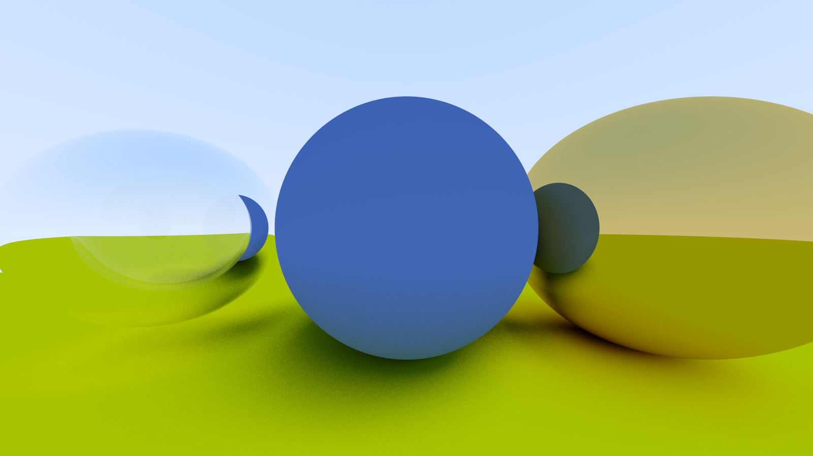
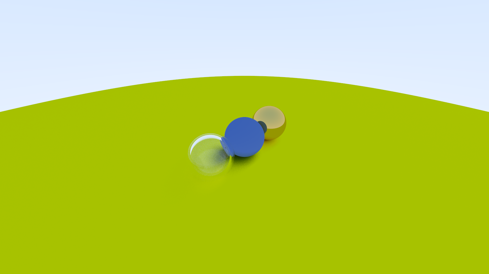

Raytracer written in c. 

Taken from https://raytracing.github.io/books/RayTracingInOneWeekend.html

Examples:

Diffuse sphere with lambertian scattering: 

3 spheres: a diffuse one in the center and two metallic ones (reflective-based scattering) on each side: 

3 spheres: glass (hollow glass sphere), diffuse, and metal: 

3 spheres adjusting the camera to view from a different angle: 

3 spheres adjusting field of view for a zoom effect: 
