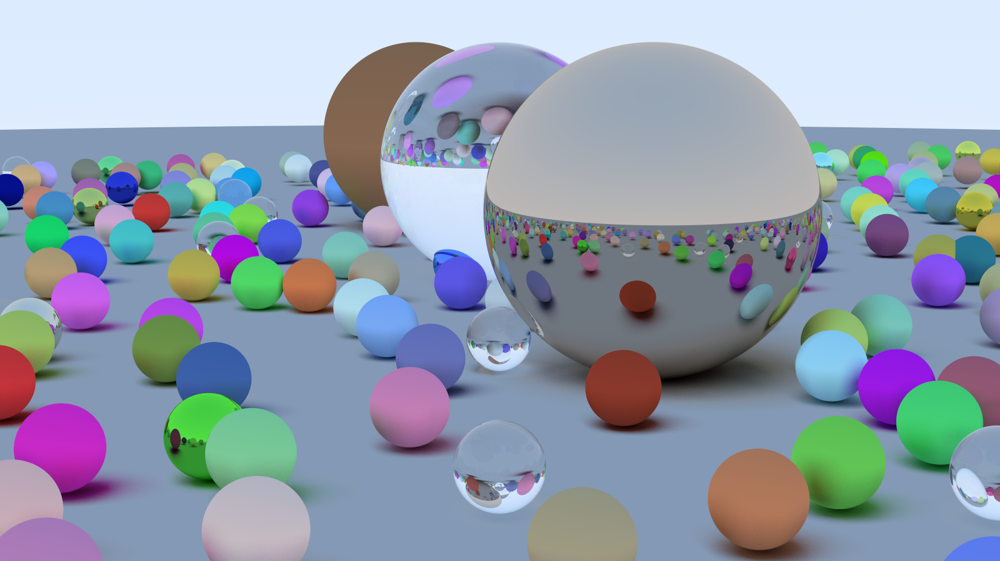
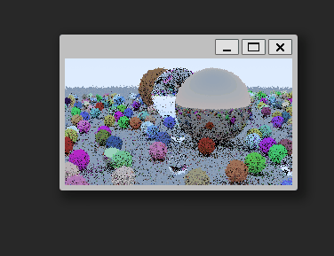
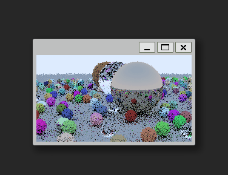

# Raytracer written in c. 

## Planned upgrades/features:

* [x] implement BVH for spheres
* [x] support loading in triangle meshes
* [x] speed up triangle meshes with BVH support
* [ ] refactor to header + implementation instead of headerless everywhere (In progress)
* [ ] support fully keyboard, ie aswd for movement, up/down/left/right or mouse for camera angle
* [ ] debug/visualize BVH by implementing ray-quad intersection
* [ ] add emissive objects, overall more cohesive material types
* [ ] optionally run multi-threaded
* [ ] implement material that links rays between 2 materials (ie portal-esque render)

## High quality single-frame renders

Taken from https://raytracing.github.io/books/RayTracingInOneWeekend.html

High Quality Renders: 

## Realtime renders

Some work take from https://raytracing.github.io/books/RayTracingTheNextWeek.html. 

Final render of course homepage, frame-by-frame realtime (settings turned way down): 

This is using SDL2 to create the window and render the image to the frame. Everything else is still custom. Next steps are to implement bounding-volume hierarchies to remove the unnecessary ray bounces being calculated all over the scene. Then adding image smoothing and keyboard inputs after that.

Render with the camera center slowly panning overtime.

